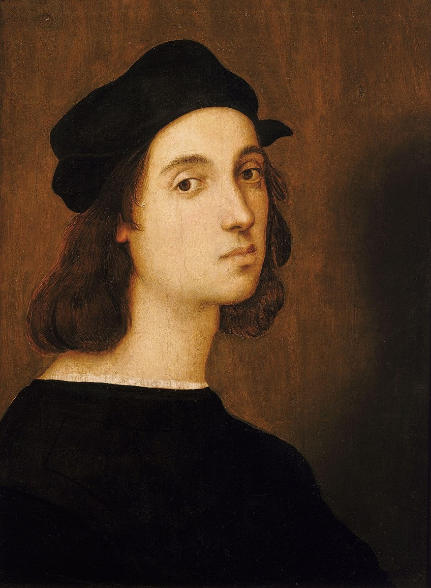

# philosopy_calender

  
          

              
              <button type="button" class="btn btn-outline-light" id="toast1">.1.</button>

              

                

                  Renaissance masters Raffaello Sanzio da Urbino 
                  
                  <button type="button" class="btn-close ml-2 mb-1" data-dismiss="toast" aria-label="Close"> x </button>                

                

                  His frescoe School of Athen was painted around the years 1509 and is still to be seen in Vatican.
                

              

            

            

              
              <button type="button" class="btn btn-outline-light" id="toast2">.2.</button>

              

                

                  Appollo the Good of truth, music and poetry 
                  
                  <button type="button" class="btn-close ml-2 mb-1" data-dismiss="toast" aria-label="Close"> x </button>                

                

                  Important dives connected to Appollo was   "Be truth to yourself" and   "Always be moderate"
                

              

            

         

         

         

       
       